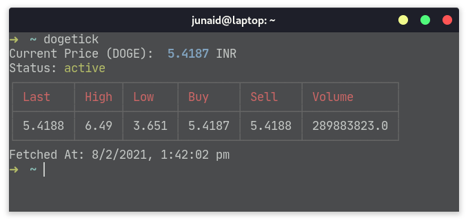

An INR based ticker CLI for **$DOGE** built using the WazirX API

[](https://npmjs.org/package/dogetick)

<div align="center">
	
</div>

## Installation

```sh-session
npm install -g dogetick
```

## Usage

```sh-session
$ npm install -g dogetick

$ dogetick 
Current Price (DOGE):  5.4103 INR
Status: active
┌──────┬──────┬───────┬────────┬──────┬─────────────┐
│ Last │ High │ Low   │ Buy    │ Sell │ Volume      │
├──────┼──────┼───────┼────────┼──────┼─────────────┤
│ 5.42 │ 6.49 │ 3.651 │ 5.4103 │ 5.42 │ 290303986.0 │
└──────┴──────┴───────┴────────┴──────┴─────────────┘
Fetched At: 08/02/2021, 13:32:29

$ dogetick --help [COMMAND]
An INR ticker for $DOGE based on the WazirX API

USAGE
  $ dogetick

OPTIONS
  -h, --help     show CLI help
  -v, --version  show CLI version
```
